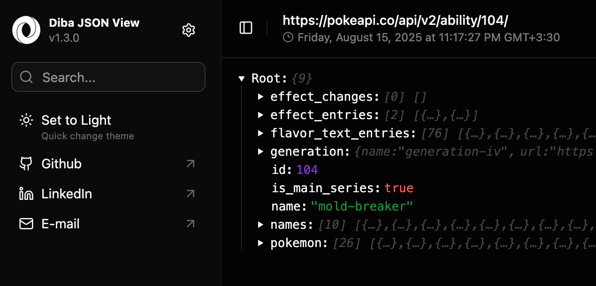

## Diba JSON View
Prettifying JSON content + Custom JSON Injection

## Features:

- Fast Prettifying JSON Contents
- Custom JSON Injection
- Dark/Light Theme Support 
- Quick ZoomIn/ZoomOut View
- Fully Customizable
- Completely Safe

## How to Install:
1. Download ZIP file
2. Extract ZIP file
3. Open chrome and go to `Manage Extensions`
4. Turn on `Developers mode`
5. Click `Load unpacked` button
6. Select extracted extension folder
7. That's all, Enjoy!
